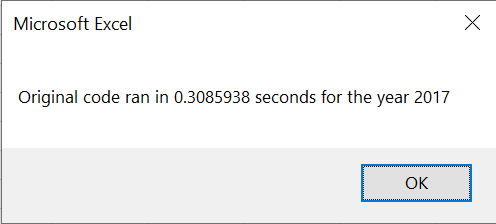

# An Analysis of Stock Performance

# Refactoring our VBA Code

## Overview of Project

### We were asked to write code to help Steve analyze his fathers stock portfolio performance. We wrote the initial VBA code to measure yearly performance and to print and format the table of results. We then had to refactor the code because of concerns of how well it would work if we were to expand it to thousands of different stocks. Then we compare the efficiency of the refactored code cdompared to the original.

## Analysis and Results

### Analysis of Stock Performance by Year

#### 2017 Stock Performance


#### 2018 Stock Performance


We first looked at the performance of the stocks for 2017 and 2018. The first this we see is 2017 was a good year for the stocks overall. All but TERP were green. DQ, ENPH, FSLR, and SEDG all post over 100% return. However, 2018 was a bad year for these stocks. All but two, ENPH and RUN, were in the red. ENPH and RUN both had above 80% Returns. We then calculated the return over the two year period. We find the following: 


We are told that Steves dad did not diversify and only had DQ stock. If he bought the stock at the beginning of 2017 and sold at the end of the year, he would be up almost 200%. If he bought the stock at the beginning of 2018 and sold at the end of the year, he would have lost 62%. Finally, if he bought in the beginning of 2017 and sold at the end of 2018, he would still be up 11%.

### Analysis of the Execution Time of the Code

In our refactored code, we combined the allStockAnalysis() and formatAllStockAnalysis() into one subroutine In order to make this comparison more reasonable, we added a call to the formatAllStockAnalysis() subroutine right before we end the timer in our VBA script. This allows us to more accurately compare the runtime. 

```
Call formatAllStockAnalysis

endTime = Timer
```

What we find is that the refactored code executes faster that the original code for both years. We got rid of the nested for loop and stored the information in arrays before printing them out and finally refactoring our code. We broke one big problem into smaller steps and it had an effect on our execution time for this small list of stocks. Once we start working with thousands of stocks, those little changes will help us get significantly better execution times. 

#### 2017 Execution Times



#### 2018 Execution Times


## Summary

### Advantages and Disadvantages of Refactoring Code in General

Refactoring code comes with advantages and disadvantages. When you first get to a working solution, it might not be the cleanest code or the best way to reach the goal. Some of the advantages of going back and refactoring the code is that you can get faster runtimes and more easily readable code by removing some of the redundancy. A big disadvantage is that you might make some mistakes which will add more time to an already time consuming process.

### Advantages and Disadvantages of the Original and Refactored Code 

When we compare the refactored code to the original, we can see that one of the advantages of the refactored code is that it exectures faster. We used arrays to store information while we iterate through the yearly data and print our findings afterswards. This allowed us to get rid of nested for loop and we dont have to loop through to the end of the yearly sheet for each ticker. This drops our time complexity from O(n^2) to O(n). When we work with bigger sets, we will see a significant difference in performance. But everything comes at a cost. We are sacrficing memory for speed. The advantage of the original is that you use less memory. Instead of storing our results, we print them right away. 
