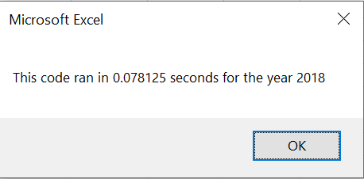

# An Analysis of Stock Performance

# Refactoring our VBA Code

## Overview of Project

### We performed the analysis of the stocks for Steve to be able to help his dad.

## Analysis and Results

### Analysis of Stock Performance by Year

The analysis is well described with screenshots and code (4 pt)

## Summary

- There is a detailed statement on the advantages and disadvantages of refactoring code in general

- There is a detailed statement on the advantages and disadvantages of the original and refactored VBA script (3 pt).