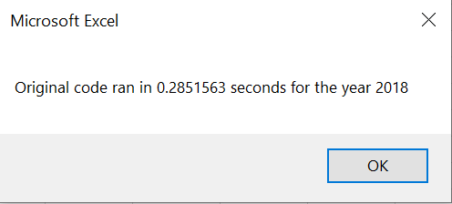

# An Analysis of Stock Performance

# Refactoring our VBA Code

## Overview of Project

### We were asked to write code to help Steve analyze his fathers stock portfolio performance. We wrote the initial VBA code but then were asked to refactor the code because of concerns of how well it would work if we were to expand it to thousands of different stocks. We then start refactoring the code and compare it to the original to determine which is faster.

## Analysis and Results

### Analysis of Stock Performance by Year

The analysis is well described with screenshots and code (4 pt)

## Summary

- There is a detailed statement on the advantages and disadvantages of refactoring code in general

- There is a detailed statement on the advantages and disadvantages of the original and refactored VBA script (3 pt).
